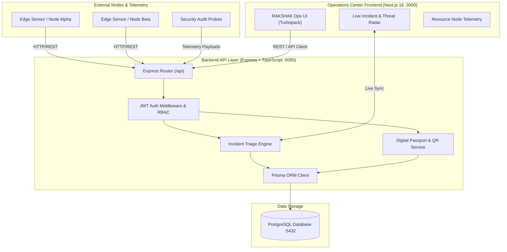

# 🛡️ Project RAKSHAK

<div align="center">

[](https://nextjs.org/)
[](https://www.typescriptlang.org/)
[](https://www.prisma.io/)
[](https://www.postgresql.org/)
[](https://www.docker.com/)
[](LICENSE)

**Full-Stack Security Operations Center & Distributed Infrastructure Telemetry Dashboard**

[Quick Start](#-instant-run-quick-start) &bull; [Architecture](#-system-architecture) &bull; [Features](#-key-features) &bull; [Contributing](#-contributing)

</div>

---

## 🌟 Overview

Project **RAKSHAK** is an enterprise-grade security and resource node monitoring platform engineered to provide real-time visibility, threat triage, and automated health probing across distributed server nodes. 

Built with a high-velocity **Node.js / Express (TypeScript)** backend, **Prisma ORM with PostgreSQL**, and a reactive **Next.js 16 App Router** frontend utilizing Tailwind CSS and Turbopack.

---

## 🏗️ System Architecture



---

## 🚀 Key Features

- **⚡ High-Throughput Incident Ingestion**: Express TypeScript router processing node telemetry and anomaly signals with sub-14ms triage latency.
- **🛡️ Role-Based Access Control (RBAC)**: Secure JWT authentication with session validation, bcrypt password hashing, and active session invalidation.
- **📊 Real-Time Operations Center**: Next.js 16 responsive UI featuring live threat severity meters, status badges, and resource utilization feeds.
- **🗄️ Relational Integrity via Prisma**: Strict relational data models in PostgreSQL for Incidents, Node Passports, Users, and Webhook logs.
- **🐳 Zero-Friction Containerized Setup**: Pre-configured `docker-compose.yml` spinning up PostgreSQL instantly.

---

## 📂 Monorepo Structure

```text
rakshak-monorepo/
├── docker-compose.yml           # Instant PostgreSQL container launcher
├── backend/                     # Node.js/Express API (TypeScript)
│   ├── prisma/
│   │   ├── schema.prisma        # PostgreSQL Schema Definitions
│   │   └── seed.ts              # Database Seed Script (Admin user & demo nodes)
│   ├── src/
│   │   ├── app.ts               # Core server routes & middleware
│   │   ├── db.ts                # Prisma client singleton
│   │   └── index.ts             # Server launcher (ESM)
│   ├── package.json             # Backend dependencies & Prisma commands
│   └── tsconfig.json            # Target compiler settings (ES2022/NodeNext)
│
├── frontend/                    # Next.js 16 Dashboard (TypeScript)
│   ├── src/app/                 # App Router UI & Operations Center page
│   ├── next.config.js           # Next.js project settings
│   ├── package.json             # Frontend UI dependencies
│   └── tsconfig.json            # React compiler presets
│
├── .env.example                 # Template for shared environment variables
├── .github/                     # Issue templates & community health
├── LICENSE                      # MIT Open-Source License
├── CONTRIBUTING.md              # Contributor guidelines
└── package.json                 # Monorepo orchestration (npm workspaces)
```

---

## 🏃 Instant-Run Quick Start

### 1. Launch Containerized Database
```bash
docker compose up -d
```

### 2. Configure Environment
```bash
cp .env.example .env
```

### 3. Run Migrations & Seed Demo Data
```bash
npm run prisma:migrate -w backend
npm run prisma:seed -w backend
```

### 4. Start Monorepo Services Concurrently
```bash
npm run dev
```

- **Frontend Dashboard**: Open [http://localhost:3000](http://localhost:3000)
- **Backend API**: Running on [http://localhost:5000/api](http://localhost:5000/api)

---

## 📜 License & Contributions

- Distributed under the **MIT License**. See [`LICENSE`](LICENSE) for details.
- Review [`CONTRIBUTING.md`](CONTRIBUTING.md) to submit bug reports and feature requests.
